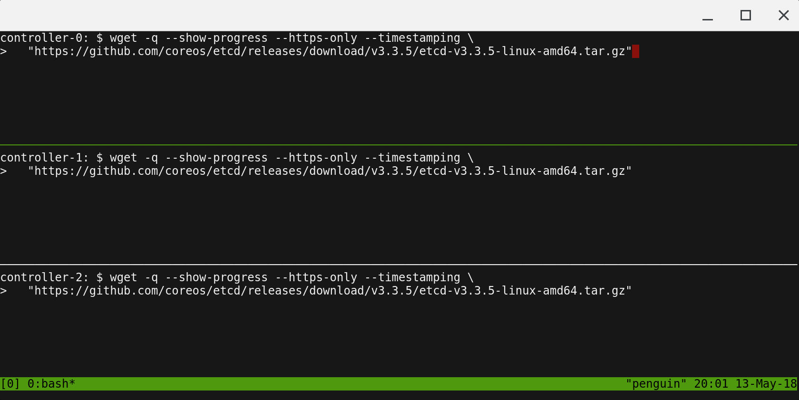

# Prerequisites

## Alibaba

This tutorial leverages [Alibaba Cloud](https://www.alibabacloud.com/) to streamline provisioning of the compute infrastructure required to bootstrap a Kubernetes cluster from the ground up. It would cost less then $2 for a 24 hour period that would take to complete this exercise.

> There is a free tier for Alibaba, though it expires after 12 months. So make sure that you clean up the resource at the end of the activity to avoid incurring unwanted costs if you accidentally leave resources running for longer than 12 months.

## Alibaba CLI (Aliyun CLI)

Technically referred to as Aliyun CLI, because that was the original name of the service (kind of like how Google is now Alphabet, but everybody still calls it Google).

### Install the Aliyun CLI

Follow the Aliyun CLI [documentation](https://github.com/aliyun/aliyun-cli?tab=readme-ov-file#installation) to install and configure the `aliyun-cli` command line utility.

The current walkthrough was done with version 3.0.196.

Verify the Aliyun CLI version using:

```
aliyun-cli version
3.0.196
```

### Configure the Aliyun CLI

Before actually configuring the CLI, you'll need to generate some access credentials, and the easiest way to do this is to create a RAM user (similar to an IAM user in AWS/GCP terminology). You can do that via the [RAM console](https://ram.console.aliyun.com/users/create). Make sure to copy down the `AccessKeyID` and `AccessKeySecret`. Go ahead and grant the `AdministratorAccess` policy to the new user, since we can delete the user once the lab is finished, and that's easier than attaching a whole bunch of policies for the different services.

Now that you've got a user with access and credentials, use that to configure the CLI. You'll need to also set the default region, for which you'll need the [Region ID](https://www.alibabacloud.com/help/en/apsaradb-for-mybase/latest/region-ids).

Follow the [configuration instructions](https://github.com/aliyun/aliyun-cli?tab=readme-ov-file#configure) to get your CLI ready to interact with your account.


## Running Commands in Parallel with tmux

[tmux](https://github.com/tmux/tmux/wiki) can be used to run commands on multiple compute instances at the same time. Labs in this tutorial may require running the same commands across multiple compute instances, in those cases consider using tmux and splitting a window into multiple panes with `synchronize-panes` enabled to speed up the provisioning process.

> The use of tmux is optional and not required to complete this tutorial.



> Enable `synchronize-panes`: `ctrl+b` then `shift :`. Then type `set synchronize-panes on` at the prompt. To disable synchronization: `set synchronize-panes off`.

Next: [Installing the Client Tools](02-client-tools.md)
